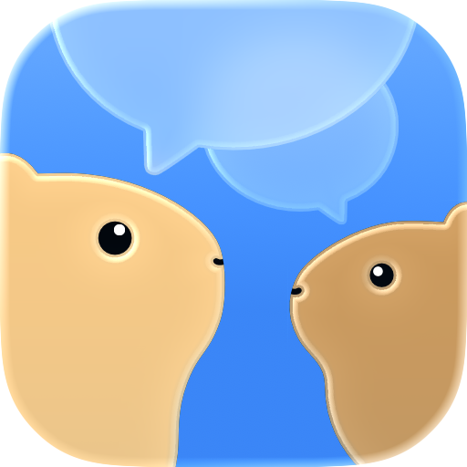

  

  <h1 align="center">CuIRC</h1>
  

    <em>Cui cui cui!</em> — A native IRC client for iPhone, iPad, and Mac.
  

  
  
  
  

---

**CuIRC** is a native IRC client for iPhone, iPad, and Mac. The name is a play on how guinea pigs chat (*cui cui cui* 🐹) and, of course, IRC. It's written from scratch in UIKit with Liquid Glass styling and a SwiftNIO networking core, plus the platform touches you'd want on modern Apple devices: a sidebar workspace on iPad and Mac, Dynamic Island, Live Activities, rich text, Dynamic Type, and localization in 22 languages.

This repo is where CuIRC lives in public. Report bugs, request features, and see what's coming next. The app is a public TestFlight beta, so anyone can join.

## 📲 Join the beta

CuIRC is in open **TestFlight** beta:

### 👉 [testflight.apple.com/join/VmrhH4bc](https://testflight.apple.com/join/VmrhH4bc)

1. Install [TestFlight](https://apps.apple.com/app/testflight/id899247664) from the App Store.
2. Open the [invite link](https://testflight.apple.com/join/VmrhH4bc) above and tap **Accept**.
3. Tap **Install** and start chatting.

**Requires** iOS 26+, iPadOS 26+, or macOS 26+.

> Beta builds change fast. If something breaks, please tell us, see [Reporting issues](#-reporting-issues--feedback) below.

## 🆕 What's new in Beta 2

Beta 2 is the workspace release: a sidebar workspace on iPad and Mac, a one-handed Home on iPhone, a rebuilt in-chat search, per-selection formatting, send options that respect the server's limits, and a long list of IRCv3 capabilities. The full list is in the [changelog](CHANGELOG.md).

## ✨ Highlights

**One app, every screen**
- Sidebar workspace on iPad and Mac: All Chats, Unread and Mentions destinations, servers grouped underneath, and a chat details inspector beside the conversation.
- Conversations in their own windows, movable between windows, restored after a restart.
- Menu bar commands with keyboard shortcuts on iPad and Mac.
- Home as a list or as cards on iPhone, with unread and mention filters.
- Fully native UIKit interface with Liquid Glass styling, full Dynamic Type, and 22 languages.

**Rich, real-time chat**
- Rich text formatting: bold, italic, underline, strikethrough, mono, text and background colors, extended palette and reverse video. Style only the text you select and mix styles in one message.
- Format panel, edit menu and hardware keyboard shortcuts.
- Copy a message as text, rich text or as itself. Drag formatted text in and out of the composer.
- Send options: split or multiline for long messages, with a live preview. CuIRC trims or asks before anything exceeds the server's limits.
- Inline URL previews, image previews with a gallery, and link/chat peek.
- In-chat search with highlighted matches and transcript dimming, steady while messages arrive.
- Mention highlighting, swipe-to-reply, and smart scrolling that remembers where you left off.
- Per-target unread tracking, timestamps, and a floating date indicator.
- Chat wallpapers with a preview on every device.

**Power features**
- **Location-based profiles**: automatically connect or disconnect from servers based on where you are and what time it is.
- **Location sharing** with Live Activity + Dynamic Island, one-time or recurring.
- **Image upload & editor** (Catbox, ImgBB) with crop, rotate, watermark, adjust, censor, and draw tools.
- **App Lock** with Face ID or Touch ID on iPhone and iPad.

**IRC support**
- IRCv3 capability negotiation, message tags, batches and chat history (see the [matrix below](#-ircv3-capabilities)).
- Server rules honoured: `CASEMAPPING`, `CHANTYPES`, `STATUSMSG`, `PREFIX` and the advertised length limits.
- Authentication via SASL, NickServ, and ZNC. Service and bouncer conversations (for example ZNC `*status`).
- WHOIS with WHO/WHOX enrichment, channel topic, creation time and website with a topic editor, channel modes, channel discovery, and user lists.
- Moderation tools: kick, ban (with mask helper), and role management.
- Ignore by nickname or address, slash commands with helpers, and command body splitting.

**Notifications**
- Per-scope rules (global, server, chat) for messages, mentions, and system events.
- Reply directly from a notification, with deep links into the conversation.
- Custom rules that let you define your own keyword and pattern triggers to get notified (and highlight matching messages) beyond plain mentions.

## 🔌 IRCv3 capabilities

Where CuIRC stands on the IRCv3 spec today. Supported caps are negotiated automatically on connect (`sasl` only when you've configured authentication).

> **Goal:** we aim to support every capability in the [IRCv3 registry](https://ircv3.net/registry) that isn't marked `[draft]` or `[deprecated]`. The tables below track current progress.

| Capability | Supported |
|---|:---:|
| `account-notify` | ✅ |
| `account-tag` | ✅ |
| `away-notify` | ✅ |
| `batch` | ✅ |
| `cap-notify` | ✅ |
| `chghost` | ✅ |
| `extended-join` | ✅ |
| `extended-monitor` | ✅ |
| `invite-notify` | ✅ |
| `labeled-response` | ✅ |
| `message-tags` | ✅ |
| `monitor` | ✅ |
| `multi-prefix` | ✅ |
| `no-implicit-names` | ✅ |
| `sasl` (v3.1) | ✅ |
| `server-time` | ✅ |
| `setname` | ✅ |
| `standard-replies` | ✅ |
| `userhost-in-names` | ✅ |
| `echo-message` | 🚧 Planned |
| `sasl` (v3.2) | 🚧 Planned |
| `sts` | 🚧 Planned |

### Message tags

| Tag | Supported | Requires |
|---|:---:|---|
| `account` | ✅ | `account-tag` |
| `batch` | ✅ | `batch` |
| `bot` | ✅ | `message-tags` |
| `label` | ✅ | `labeled-response` |
| `msgid` | ✅ | `message-tags` |
| `time` | ✅ | `server-time` |
| `+channel-context` | 🚧 Planned | `message-tags` |
| `+reply` | 🚧 Planned | `message-tags` |
| `+typing` | 🚧 Planned | `message-tags` |

### Batch types

| Batch | Supported | Requires |
|---|:---:|---|
| `chathistory` | ✅ | `batch` |
| `labeled-response` | ✅ | `labeled-response` |
| `netjoin` | 🚧 Planned | `batch` |
| `netsplit` | 🚧 Planned | `batch` |

### Server features (`RPL_ISUPPORT`)

CuIRC reads `CASEMAPPING`, `CHANTYPES`, `STATUSMSG`, `PREFIX`, `MONITOR`, and the `NICKLEN`, `CHANNELLEN`, `KEYLEN`, `TOPICLEN`, `KICKLEN`, `AWAYLEN`, `USERLEN`, `HOSTLEN`, `NAMELEN` and `LINELEN` limits, and applies them to name folding, channel joins, message targets and outgoing messages.

You can inspect what a server advertised versus what got negotiated from the in-app server capabilities viewer.

## 🗺️ Roadmap

Planned and in-progress work lives in [Issues](../../issues) and [Milestones](../../milestones). A few things on the way:

- Channel mode management UI
- Message history and templates beside the composer
- Universal search
- Chat export & message translation
- More IRCv3 capabilities (see the [matrix above](#-ircv3-capabilities))
- **Longer term:** ZNC push plugin, DCC, iCloud Sync

## 🐛 Reporting issues & feedback

Found a bug or have an idea? This is the place.

- **[Report a bug](../../issues/new/choose)**: include your device, OS version, and steps to reproduce.
- **[Request a feature](../../issues/new/choose)**: tell us what you're trying to do.
- **[Discussions](../../discussions)** for questions, ideas, and general chat.

A quick search of [existing issues](../../issues) first helps avoid duplicates.

## 🔒 Privacy

Your data stays on your device.

- **No account, no tracking.** CuIRC has no backend of its own; it talks directly to the IRC servers you configure.
- **Location** is only used for the features you turn on (location-based profiles, location sharing), and only while they're enabled.
- **Images** upload only when you choose to, to the third-party host you pick (Catbox or ImgBB).
- **App Lock** keeps the app behind Face ID or Touch ID on iPhone and iPad.
- Servers, credentials, and history are stored locally on your device.

## 🙌 Credits

CuIRC's IRC core uses code from the open-source [swift-nio-irc](https://github.com/SwiftNIOExtras/swift-nio-irc) and [swift-nio-irc-client](https://github.com/NozeIO/swift-nio-irc-client) (Apache 2.0), built on Apple's [SwiftNIO](https://github.com/apple/swift-nio). Full third-party acknowledgements are available in the app's Settings.

## License

CuIRC is proprietary software, free to use during the beta. The source code is not open. Third-party components retain their original licenses (see in-app acknowledgements).

---

  Made with 🧡 and a lot of <em>cui cui cui</em> and <em>prrrrr</em>.

